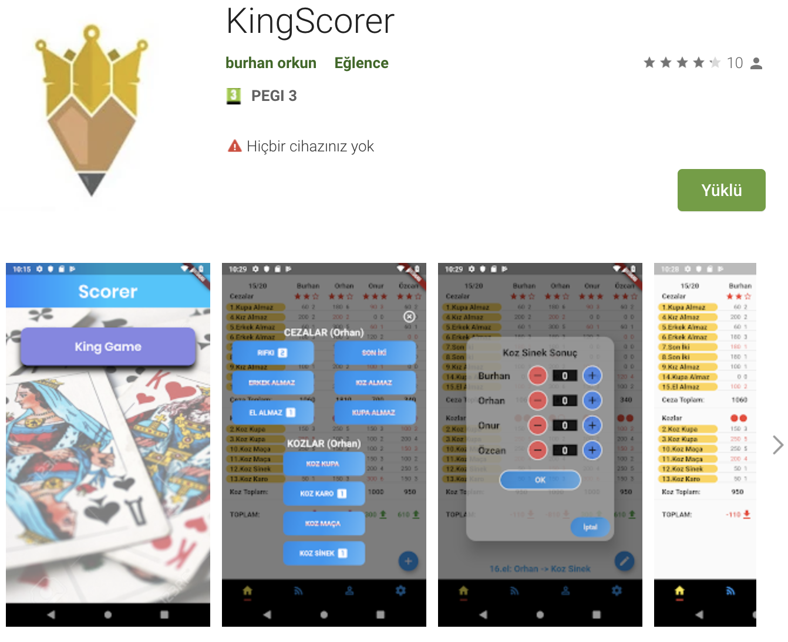
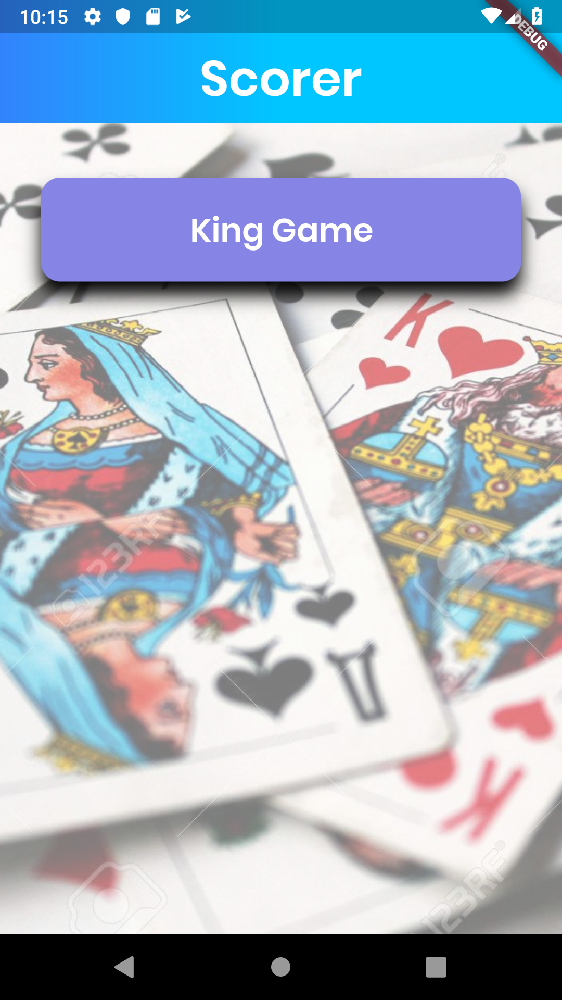
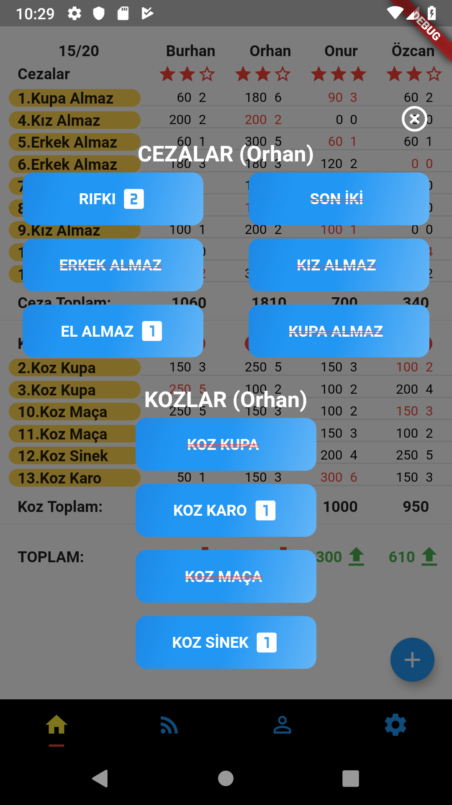
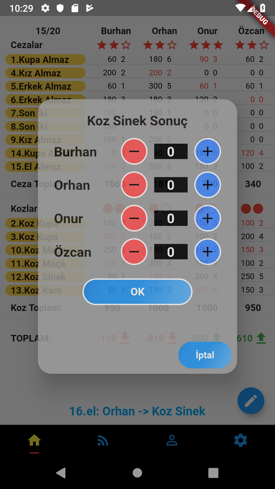
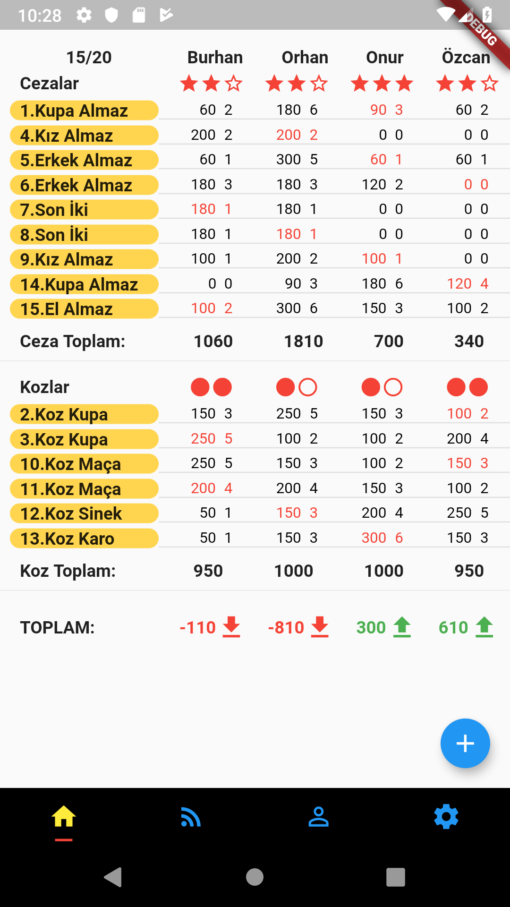

# KingScorer

It is an open source project.
It is the score board program of the King card game.

You can download from Google Play [KingScorer](https://play.google.com/store/apps/details?id=com.orkun.kingscorer&gl=TR).

 

---

## Getting Started

 
This is an open source project which has been published on Google market. It is suitable for publishing on the Apple market, but we could not publish it because we do not have an apple developer license. Apple developer license fee is as high as 100 per year.

You can make changes and open a PullRequest. don't hesitate.

 

---

 

# Screenshots

|      Google Play Screen       |
| :---------------------------: |
|  |

 

|        Welcome Screen         |        Game Selection         |
| :---------------------------: | :---------------------------: |
|  |  |

 

|         Result Screen         |      Score Board Screen       |
| :---------------------------: | :---------------------------: |
|  |  |

 

---

## Detail

This project is a starting point for a Flutter application.

A few resources to get you started if this is your first Flutter project:

- [Lab: Write your first Flutter app](https://flutter.io/docs/get-started/codelab)
- [Cookbook: Useful Flutter samples](https://flutter.io/docs/cookbook)

For help getting started with Flutter, view our
[online documentation](https://flutter.io/docs), which offers tutorials,
samples, guidance on mobile development, and a full API reference.

---
